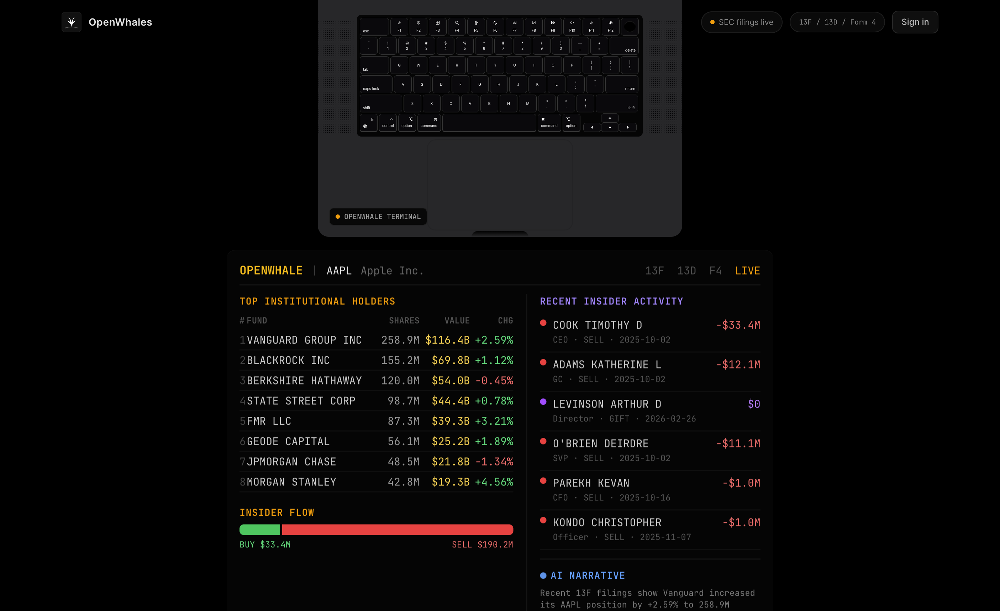

# [open-whales.com](https://open-whales.com)




**OpenWhales** is an open-source, AI-powered SEC filing intelligence platform. Track what smart money (institutional investors, activist funds, and corporate insiders) is doing across 177 public stocks and 130+ prominent fund managers. Search by ticker or investor name to surface 13F holdings, Form 4 insider trades, and 13D/G activist stakes, then get AI-synthesized narratives that connect the dots.

**[Join our Discord](https://discord.gg/VVqdWvyJS9)** for updates and support.

## What It Does

This tool transforms hours of SEC filing research into seconds of automated intelligence. Input a ticker or investor name, and receive:

- **13F Institutional Holdings** — Who owns what, position changes, and dollar values
- **Form 4 Insider Trades** — Executive buys, sells, exercises, and awards with full transaction details
- **13D/G Activist Stakes** — Activist investor disclosures and stake changes
- **AI-Synthesized Narratives** — Streaming markdown analysis connecting institutional moves, insider activity, and smart money signals
- **Deep Dive Chat** — Multi-turn conversational analysis with access to SEC, finance, economics, and company research tools

## Search Types

| Type | Use Case | Example Inputs |
|------|----------|----------------|
| **Ticker Lookup** | Analyze institutional ownership and insider activity for a stock | "AAPL", "NVDA", "TSLA" |
| **Investor Search** | View portfolio holdings and strategy for a prominent fund manager | "Warren Buffett", "Bill Ackman", "Cathie Wood" |
| **Trending Dashboard** | Surface stocks with notable smart money activity | Auto-generated for 8 major tickers |

## Features

- **SEC Filing Analysis** — Pulls current 13F, 13D/G, and Form 4 data for any of 177 supported tickers
- **Investor Name Search** — Search 170+ prominent investors (Buffett, Ackman, Cathie Wood, Dalio, etc.) by name to view portfolio holdings, transactions, and AI-generated investment strategy narratives
- **Deep Dive Chat** — Multi-turn conversational analysis for both tickers and investors, powered by OpenAI with access to SEC, finance, economics, and company research tools via [Valyu](https://docs.valyu.ai/integrations/vercel-ai-sdk)
- **AI-Generated Narratives** — Streams markdown analysis covering institutional ownership, activist shareholders, insider activity, and an overall smart money signal
- **Trending Dashboard** — Surfaces stocks with notable smart money activity (cached with a 6-hour TTL)
- **Data Visualizations** — Donut charts for insider buy/sell splits, bar charts for value breakdowns, and timeline components for transaction history
- **Unified Search** — Autocomplete search across both tickers and investor names with keyboard navigation
- **Two Deployment Modes** — Self-hosted (shared API key) or Valyu mode (per-user OAuth with individual billing)
- **MacBook Terminal Demo** — Interactive scroll animation showcasing a Bloomberg-style terminal with institutional holdings and insider activity data
- **Dark Mode** — Toggleable light/dark theme
- **Redis Caching** — Redis-backed cache with 6-hour TTL for ticker data, investor data, and narratives, with graceful fallback when Redis is unavailable

## App Modes

OpenWhales supports two deployment modes controlled by the `NEXT_PUBLIC_APP_MODE` environment variable:

### Self-Hosted Mode (Default)

```env
NEXT_PUBLIC_APP_MODE=self-hosted
```

- **No user authentication required** — anyone with access to the app can run searches
- Uses a single **server-side Valyu API key** (`VALYU_API_KEY`) for all requests
- All API costs are billed to the API key owner
- Ideal for internal team deployments, personal use, or private instances
- Only requires `VALYU_API_KEY` and `OPENAI_API_KEY` to be set

### Valyu Mode

```env
NEXT_PUBLIC_APP_MODE=valyu
```

- **Requires user authentication** via OAuth 2.0 with PKCE (Valyu as identity provider)
- Each user signs in with their Valyu account and uses their own credits
- API costs are billed to the individual user's Valyu account
- Ideal for public-facing deployments like [open-whales.com](https://open-whales.com)
- Requires OAuth configuration: `NEXT_PUBLIC_VALYU_CLIENT_ID`, `VALYU_CLIENT_SECRET`, `NEXT_PUBLIC_VALYU_AUTH_URL`, `VALYU_APP_URL`, and `NEXT_PUBLIC_REDIRECT_URI`

## Tech Stack

| Component | Technology |
|-----------|-----------|
| Framework | Next.js 16 (App Router) |
| Language | TypeScript 5 |
| Styling | Tailwind CSS 4 |
| AI / LLM | Vercel AI SDK 6 + OpenAI (gpt-5.4) |
| SEC Data | [Valyu API](https://docs.valyu.ai/) ([`@valyu/ai-sdk`](https://www.npmjs.com/package/@valyu/ai-sdk)) |
| State | Zustand 5 |
| Validation | Zod 4 |
| Markdown | remark-gfm + streamdown |
| UI | Lucide icons, Phosphor icons, Motion, Aceternity MacBook Scroll |
| Caching | Redis (ioredis) |
| Auth | OAuth 2.0 PKCE ([Valyu Platform](https://platform.valyu.ai)) |
| Fonts | Inter, Space Grotesk, Playfair Display, JetBrains Mono |

## Getting Started

### Prerequisites

- Node.js 18+
- npm
- Valyu API key (get one at [platform.valyu.ai](https://platform.valyu.ai))
- OpenAI API key

### Option A: Self-Hosted Mode

Best for personal use or internal teams. You provide your own API keys and all users share a single Valyu quota. No sign-in required.

1. **Clone the repository**
   ```bash
   git clone https://github.com/unicodeveloper/openwhales.git
   cd openwhales
   ```

2. **Set up environment variables**
   ```bash
   cp .env.example .env.local
   ```

   ```env
   OPENAI_API_KEY=sk-proj-...           # OpenAI API key
   VALYU_API_KEY=val_...                # Valyu API key
   NEXT_PUBLIC_APP_MODE=self-hosted

   # Optional
   REDIS_URL=redis://localhost:6379     # Enables 6h caching (app works without it)
   ```

3. **Install and run**
   ```bash
   npm install
   npm run dev
   ```

4. **Open [http://localhost:3000](http://localhost:3000)** — No login needed, start searching immediately.

### Option B: Valyu Mode (Multi-User with OAuth)

Best for public deployments where each user signs in with their own [Valyu](https://platform.valyu.ai) account and uses their own credits.

1. **Clone the repository**
   ```bash
   git clone https://github.com/unicodeveloper/openwhales.git
   cd openwhales
   ```

2. **Register an OAuth application** on the [Valyu platform](https://platform.valyu.ai) to get your client ID and secret

3. **Set up environment variables**
   ```bash
   cp .env.example .env.local
   ```

   ```env
   OPENAI_API_KEY=sk-proj-...           # OpenAI API key
   NEXT_PUBLIC_APP_MODE=valyu

   # OAuth credentials (from Valyu platform)
   NEXT_PUBLIC_VALYU_CLIENT_ID=...      # OAuth client ID
   VALYU_CLIENT_SECRET=...              # OAuth client secret
   NEXT_PUBLIC_VALYU_AUTH_URL=https://auth.valyu.ai
   VALYU_APP_URL=https://platform.valyu.ai
   NEXT_PUBLIC_REDIRECT_URI=http://localhost:3000/auth/valyu/callback

   # Optional
   REDIS_URL=redis://localhost:6379     # Enables 6h caching (app works without it)
   ```

4. **Install and run**
   ```bash
   npm install
   npm run dev
   ```

5. **Open [http://localhost:3000](http://localhost:3000)** — Users will see a sign-in prompt before accessing ticker or investor pages.

## Usage

### Ticker Analysis

1. Search for a ticker (e.g. AAPL) via the autocomplete search bar
2. View institutional holders table, insider buy/sell charts, and transaction timeline
3. Read the AI-generated narrative covering institutional ownership, insider activity, and smart money signal
4. Open the Deep Dive Chat to ask follow-up questions

### Investor Research

1. Search for an investor by name (e.g. "Warren Buffett")
2. View portfolio positions, transaction history, and quick stats
3. Read the AI-generated investment strategy analysis
4. Open the Deep Dive Chat to dig deeper into the investor's strategy

### Example Queries

**Ticker Lookup:**
> Search "NVDA" to see Vanguard, BlackRock, and State Street's positions alongside Jensen Huang's insider transactions

**Investor Search:**
> Search "Bill Ackman" to view Pershing Square's portfolio, recent 13F changes, and AI-generated strategy analysis

## How It Works

### Ticker Detail Page

1. User searches for a ticker (e.g. AAPL) via the autocomplete search bar
2. `/api/ticker-data` checks Redis first — if a fresh result exists (< 6 hours old), it returns instantly with no API calls
3. On cache miss, it uses OpenAI with the Valyu `secSearch` tool to extract structured data — top 10 institutional holders, up to 15 insider transactions, buy/sell counts and totals. The result is then written to Redis for subsequent requests
4. The UI renders holdings tables, buy/sell charts, and an insider timeline
5. `/api/narrative` streams an AI-written analysis as markdown, citing filing dates for every claim (not cached — always fresh)
6. A floating chat panel lets users ask follow-up questions with access to SEC, finance, economics, and company research tools

### Investor Profile Page

1. User searches for an investor by name (e.g. "Warren Buffett") via the unified search bar
2. `/api/investor-data` uses OpenAI with Valyu's SEC search to extract portfolio positions from 13F filings and transactions from Form 4 filings
3. Results are cached for 6 hours — subsequent visits return instantly
4. The UI renders a portfolio table, buy/sell chart, transaction timeline, and quick stats sidebar
5. `/api/investor-narrative` streams an AI-written investment strategy analysis covering portfolio overview, top positions, recent activity, and an overall investment signal (cached in background after streaming)
6. A floating chat panel lets users ask follow-up questions about the investor's strategy

### Trending Page

1. `/api/trending` fetches summaries for 8 major tickers (AAPL, NVDA, TSLA, MSFT, META, GOOGL, AMZN, PLTR)
2. Results are streamed as NDJSON on cache miss, served as JSON on cache hit
3. Each card shows top holders and net insider activity direction

### Deep Dive Chat

Both ticker and investor pages include a floating chat panel for multi-turn conversation. The chat endpoints use OpenAI with access to four [Valyu-powered tools](https://docs.valyu.ai/integrations/vercel-ai-sdk):

- **secSearch** — SEC filings (13F, 13D/G, Form 4, 10-K, 10-Q, 8-K)
- **financeSearch** — Stock data, earnings, balance sheets, cash flows, dividends
- **economicsSearch** — BLS, FRED, World Bank data
- **companyResearch** — Comprehensive company intelligence (leadership, products, news, funding, competitors, financials)

## Project Structure

```
src/
├── app/
│   ├── api/
│   │   ├── ticker-data/route.ts        # Fetch institutional holders + insider transactions (Redis-cached 6h)
│   │   ├── investor-data/route.ts      # Fetch investor portfolio + transactions from SEC filings
│   │   ├── narrative/route.ts          # Stream AI-generated ticker analysis
│   │   ├── investor-narrative/route.ts # Stream AI-generated investor strategy narrative
│   │   ├── chat/route.ts              # Ticker deep dive chat (multi-turn, tool-augmented)
│   │   ├── investor-chat/route.ts     # Investor deep dive chat (multi-turn, tool-augmented)
│   │   ├── trending/route.ts          # Trending tickers (NDJSON, cached)
│   │   ├── oauth/token/route.ts       # OAuth PKCE token exchange
│   │   ├── oauth/refresh/route.ts     # OAuth token refresh
│   │   └── valyu-proxy/route.ts       # Authenticated proxy for Valyu API calls
│   ├── ticker/[symbol]/page.tsx       # Ticker detail page
│   ├── investor/[slug]/page.tsx       # Investor profile page
│   ├── auth/valyu/callback/page.tsx   # OAuth callback handler
│   ├── page.tsx                       # Home (hero + MacBook demo + trending grid)
│   └── layout.tsx                     # Root layout with nav + footer + auth initializer
├── components/
│   ├── search-bar.tsx                 # Unified ticker + investor autocomplete
│   ├── trending-grid.tsx              # Trending tickers grid
│   ├── holdings-table.tsx             # 13F institutional holders table
│   ├── investor-portfolio-table.tsx   # Investor portfolio positions table (responsive)
│   ├── investor-transactions.tsx      # Investor transaction timeline
│   ├── buy-sell-chart.tsx             # Insider buy/sell donut + bar chart
│   ├── insider-timeline.tsx           # Form 4 transaction timeline
│   ├── narrative-stream.tsx           # Streaming markdown narrative
│   ├── ticker-chat.tsx                # Floating chat panel for ticker deep dives
│   ├── investor-chat.tsx              # Floating chat panel for investor deep dives
│   ├── macbook-demo.tsx               # MacBook scroll showcase
│   ├── terminal-screen.tsx            # Bloomberg-style terminal UI
│   ├── rotating-words.tsx             # Animated rotating headline words
│   ├── nav-bar.tsx                    # Transparent (home) / solid (detail) navbar
│   ├── footer.tsx                     # Site footer
│   ├── logo.tsx                       # OpenWhales whale tail icon
│   ├── auth/                          # Auth components (gate, sign-in modal, initializer)
│   └── ui/                            # Reusable UI primitives (button, card, dialog, skeleton, etc.)
├── hooks/
│   ├── use-ticker-data.ts             # Fetch ticker data
│   ├── use-investor-data.ts           # Fetch investor portfolio data
│   ├── use-narrative-stream.ts        # Stream ticker narrative
│   ├── use-investor-narrative-stream.ts # Stream investor narrative
│   ├── use-chat.ts                    # Multi-turn ticker chat
│   ├── use-investor-chat.ts           # Multi-turn investor chat
│   ├── use-trending-data.ts           # Fetch trending with NDJSON parsing
│   └── use-auth-headers.ts            # Inject Bearer token into API requests
├── stores/
│   ├── auth-store.ts                  # Zustand auth state (user, tokens, refresh, modal)
│   └── theme-store.ts                 # Zustand theme state (light/dark toggle)
├── lib/
│   ├── valyu.ts                       # Core Valyu integration + AI narrative streaming
│   ├── valyu-tools.ts                 # Valyu API tool wrappers (secSearch, financeSearch, economicsSearch, companyResearch)
│   ├── auth-utils.ts                  # Server-side auth resolution (self-hosted vs Valyu mode)
│   ├── oauth.ts                       # Client-side OAuth PKCE flow
│   ├── app-mode.ts                    # App mode detection (self-hosted vs valyu)
│   ├── redis.ts                       # Redis cache client (get/set with TTL, graceful fallback)
│   ├── schemas.ts                     # Zod validation schemas
│   ├── constants.ts                   # App constants
│   ├── tickers.ts                     # 177 supported ticker symbols
│   ├── investors.ts                   # 170+ prominent investor profiles
│   └── utils.ts                       # Utility functions
└── types/
    └── index.ts                       # TypeScript interfaces
```

## Scripts

| Command | Description |
|---------|-------------|
| `npm run dev` | Start development server |
| `npm run build` | Production build |
| `npm start` | Start production server |
| `npm run lint` | Run ESLint |

## Data Types

The app works with these core data structures:

- **InstitutionalHolder** — Name, shares, value, activity (increased/decreased/new/closed/unchanged), change percent, report date
- **InsiderTx** — Name, title, type (buy/sell/gift/exercise/award), shares, value, price per share, date
- **TickerData** — Aggregated holders + insider transactions with buy/sell counts and totals
- **InvestorPosition** — Ticker, company name, shares, value, activity, change percent, report date
- **InvestorTransaction** — Ticker, company name, type, shares, value, price per share, date
- **InvestorData** — Portfolio positions + transactions with total portfolio value, buy/sell counts and totals
- **TrendingTicker** — Symbol, top holders, and net insider activity direction

## Deploy

### Railway (Recommended)

1. Connect your GitHub repo on [Railway](https://railway.app)
2. Set the environment variables (`OPENAI_API_KEY`, `VALYU_API_KEY`, `NEXT_PUBLIC_APP_MODE`)
3. Railway will auto-detect the Next.js framework and handle the rest

For caching, add a Redis service in Railway and set `REDIS_URL` — Railway provides this automatically when you provision a Redis instance. The app works without Redis but will make fresh API calls on every request.

For Valyu mode, set the OAuth environment variables and ensure the redirect URI matches your deployed domain (`https://yourdomain.com/auth/valyu/callback`).

### Vercel

```bash
npm i -g vercel
vercel
```

Add environment variables in the Vercel dashboard.

### Docker

```dockerfile
FROM node:18-alpine
WORKDIR /app
COPY package*.json ./
RUN npm ci
COPY . .
RUN npm run build
CMD ["npm", "start"]
```

## Contributing

Contributions are welcome!

1. Fork the repository
2. Create a feature branch (`git checkout -b feature/amazing-feature`)
3. Commit your changes (`git commit -m 'Add amazing feature'`)
4. Push to the branch (`git push origin feature/amazing-feature`)
5. Open a Pull Request

## License

MIT License - see [LICENSE](LICENSE) for details.

## Acknowledgments

- [Valyu](https://valyu.ai) — SEC filing data and AI search
- [Next.js](https://nextjs.org) — React framework
- [OpenAI](https://openai.com) — LLM powering narratives and chat
- [Tailwind CSS](https://tailwindcss.com) — Styling
- [Lucide](https://lucide.dev) — Icons

---

**[Join our Discord](https://discord.gg/VVqdWvyJS9)** for updates and support.
